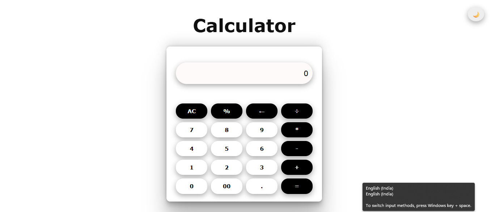
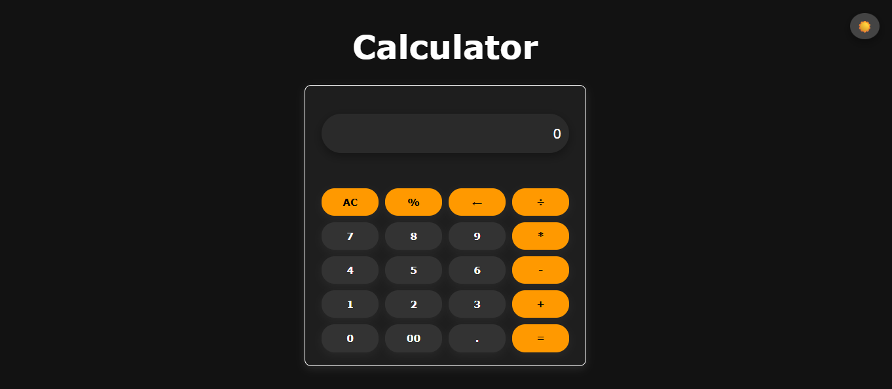

# 🧮 Web Calculator

A responsive and interactive web-based calculator built using **HTML**, **CSS**, and **JavaScript**. It performs basic arithmetic operations and features a clean UI with a dark/light theme toggle.

---

## ✨ Features

- Perform basic arithmetic operations: `+`, `−`, `×`, `÷`
- Real-time display updates
- Support for decimals and percentage (`%`)
- Clear (`AC`) and delete (`←`) buttons
- Responsive layout for mobile and desktop
- Dark/Light mode toggle for better user experience

---

## 🚀 Tech Stack

- **HTML5** – Markup
- **CSS3** – Styling, Responsiveness, Theme
- **JavaScript (ES6)** – Logic, DOM Manipulation

---

## 📸 Screenshots

  


---

## 📂 Project Structure

calculator/
│
├── index.html
├── css/
│ └── style.css
├── javascript/
│ └── script.js
├── assets/
│ └── LightMode.png
│ └── DarkMode.png
└── README.md


---

## 🛠️ How to Run Locally

1. Clone the repository:
   ```bash
   git clone https://github.com/diyarathore26/calculator.git

2. Open index.html in your browser.
